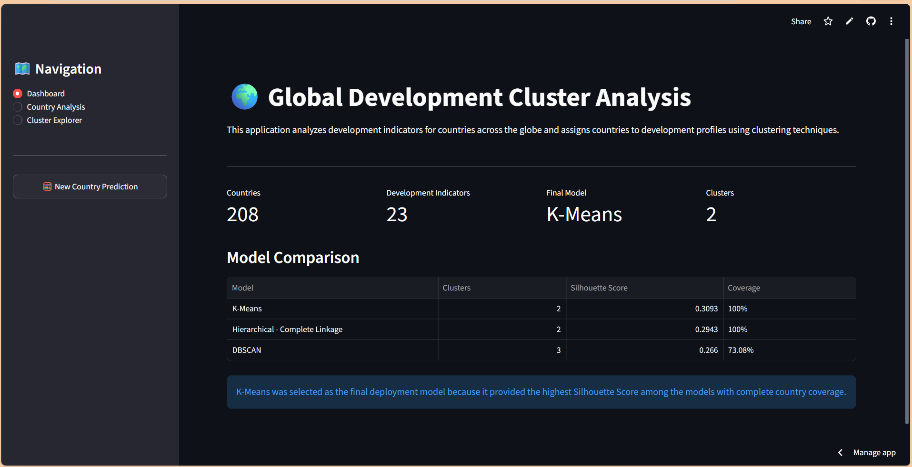
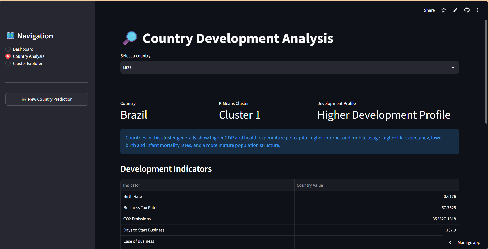
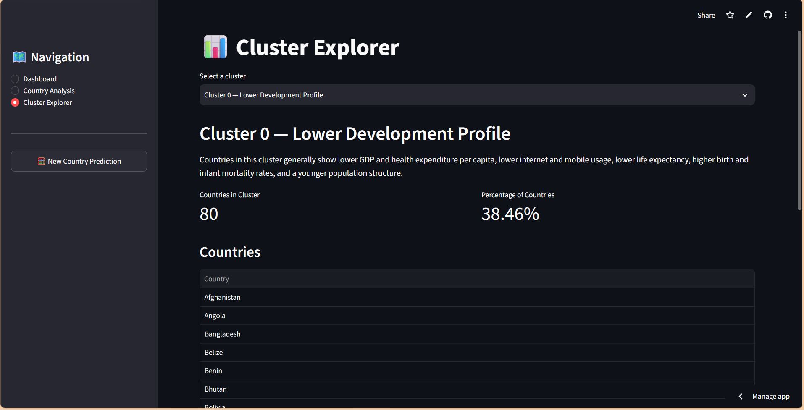
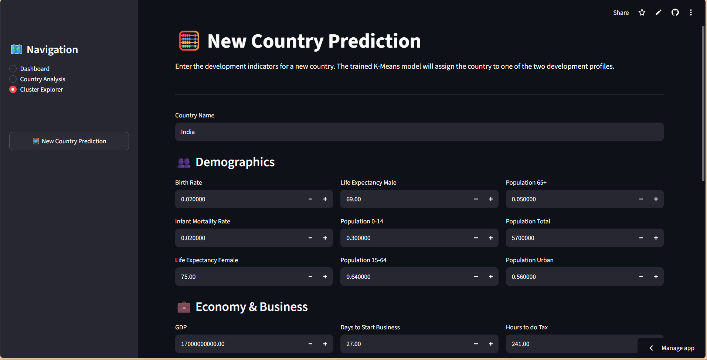

# 🌍 Global Development Clustering

An unsupervised machine learning project that analyzes global development indicators and groups countries into meaningful development profiles using clustering techniques.

The project evaluates **K-Means, Hierarchical Clustering, and DBSCAN**, selects the most suitable model based on clustering performance and country coverage, and provides an interactive **Streamlit application** for exploring the results and predicting the development cluster of a new country.

## 🚀 Live Demo

🌐 **[Open the Live Streamlit App](https://global-development-clustering-project-utkarsh.streamlit.app)**

The application is deployed using Streamlit Community Cloud and can also be run locally from this repository.

---

## 📌 Project Overview

Countries differ significantly in areas such as economic performance, healthcare, demographics, technology adoption, energy consumption, and tourism.

This project uses **unsupervised learning** to identify groups of countries with similar development characteristics without relying on predefined labels.

The analysis starts with a dataset containing multiple observations for countries and transforms it into a country-level dataset suitable for clustering.

The final application allows users to:

- Explore individual countries and their development profiles
- Compare countries with their cluster averages
- Explore the characteristics of each cluster
- View the countries belonging to each cluster
- Enter development indicators for a new country
- Predict its K-Means cluster and corresponding development profile

---

## 🎯 Objectives

- Analyze global development indicators across countries.
- Prepare and transform country-level development data for clustering.
- Identify meaningful groups of countries using unsupervised learning.
- Compare K-Means, Hierarchical Clustering, and DBSCAN.
- Select the most suitable clustering approach based on evaluation metrics.
- Interpret the resulting clusters as development profiles.
- Build an interactive application for exploring the clustering results.
- Develop a reusable pipeline for predicting the cluster of a new country.

---

## 📊 Dataset & Features

### Original Dataset

**File:** `World_development_mesurement (2).xlsx`

The original dataset contains:

- **2,704 observations**
- **208 countries**
- **13 observations per country**
- **25 original columns**

The dataset includes indicators related to:

- Demographics
- Economy and business
- Healthcare
- Technology
- Energy and environment
- Tourism
- Population

Examples include:

- GDP
- Birth Rate
- CO₂ Emissions
- Health Expenditure
- Internet Usage
- Mobile Phone Usage
- Life Expectancy
- Population Structure
- Energy Usage
- Tourism
- Business-related indicators

### Processed Dataset

The country-level processed dataset used by the Streamlit application is:

`country_development_profiles.csv`

After preprocessing and country-level aggregation, the final clustering dataset contains:

- **208 countries**
- **23 development features**
- **0 missing values**

---

## 🔧 Data Preprocessing

The data preparation pipeline consisted of the following steps:

```text
Original Dataset
      ↓
Missing Value Analysis
      ↓
Country-Level Aggregation
      ↓
Missing Value Imputation
      ↓
Skewness Analysis
      ↓
Log1p Transformation
      ↓
Standard Scaling
      ↓
Clustering
```
**Missing Value Handling**

Missing values were analyzed across all features and handled during preprocessing.

For the final country-level dataset, missing numerical values were imputed using feature-wise median values. These training-set medians were saved and reused during new-country prediction to ensure consistent preprocessing.

**Skewness Transformation**

Highly right-skewed numerical features were transformed using `log1p()` to reduce the influence of extreme values and improve the suitability of the features for clustering.

The transformation substantially reduced skewness for several features, including:

- GDP
- Population Total
- CO₂ Emissions
- Days to Start Business
- Energy Usage
- Tourism Inbound
- Tourism Outbound
- Hours to do Tax
- Business Tax Rate
- Health Expenditure per Capita

**Feature Scaling**

The processed features were standardized using `StandardScaler`.

The fitted scaler was saved and reused during new-country prediction so that new inputs undergo the same preprocessing applied during model training.

---

## 🤖 Clustering Methodology

Three unsupervised clustering approaches were evaluated to identify groups of countries with similar development characteristics.

### 1. K-Means Clustering

K-Means was evaluated using different numbers of clusters (`K`).

The models were assessed using:

- **Within-Cluster Sum of Squares (WCSS)** to evaluate cluster compactness
- **Silhouette Score** to evaluate cluster separation

The final K-Means configuration used:

- **Number of clusters:** 2
- **Silhouette Score:** 0.309315

### 2. Hierarchical Clustering

Hierarchical clustering was evaluated using four linkage methods:

- Single
- Average
- Complete
- Ward

The best balanced configuration was obtained using **Complete Linkage** with:

- **Number of clusters:** 2
- **Silhouette Score:** 0.294261

### 3. DBSCAN

DBSCAN was evaluated using different combinations of `eps` and `min_samples`.

The final valid configuration used:

- **`eps`:** 2.75
- **`min_samples`:** 5
- **Number of clusters:** 3
- **Noise points:** 56
- **Noise percentage:** 26.92%
- **Silhouette Score:** 0.266013
- **Country coverage:** 73.08%

The DBSCAN configuration with the highest Silhouette Score was not selected solely on that metric because it classified a large proportion of countries as noise. The final comparison therefore considered both clustering quality and country coverage.

---

## 📈 Model Comparison

The clustering models were compared using **Silhouette Score** and **country coverage**.

| Model | Number of Clusters | Silhouette Score | Countries Assigned | Noise Countries | Coverage |
|---|---:|---:|---:|---:|---:|
| **K-Means** | 2 | **0.309315** | 208 | 0 | **100%** |
| Hierarchical - Complete Linkage | 2 | 0.294261 | 208 | 0 | **100%** |
| DBSCAN | 3 | 0.266013 | 152 | 56 | 73.08% |

### Final Model Selection

**K-Means with 2 clusters** was selected as the final deployment model because it achieved the highest Silhouette Score among the evaluated models while assigning all **208 countries** to a cluster.

The trained K-Means model was saved as:

`kmeans_model.pkl`

---

## 🧭 Cluster Profiles

The final K-Means model identified two development profiles based on the average characteristics of the countries assigned to each cluster.

### Cluster 0 — Lower Development Profile

Countries in this cluster generally show:

- Lower GDP
- Lower health expenditure per capita
- Lower internet and mobile usage
- Lower life expectancy
- Higher birth rates
- Higher infant mortality rates
- A younger population structure

### Cluster 1 — Higher Development Profile

Countries in this cluster generally show:

- Higher GDP
- Higher health expenditure per capita
- Higher internet and mobile usage
- Higher life expectancy
- Lower birth rates
- Lower infant mortality rates
- A more mature population structure

> **Note:** These profiles describe the general characteristics of each cluster based on their average development indicators. They are not strict conditions that every country within a cluster must satisfy.

---

## 🔬 PCA Visualization

Principal Component Analysis (PCA) was used to reduce the 23-dimensional feature space to two principal components for visualization of the clustering structure.

The first two components explained:

- **Principal Component 1:** 50.03%
- **Principal Component 2:** 16.21%
- **Total variance explained:** 66.24%

The PCA visualization provides a two-dimensional view of the countries and their resulting cluster assignments.

---

## 🖥️ Streamlit Application

The project includes an interactive Streamlit application that provides four main sections for exploring the clustering results and making predictions.

### 📊 Dashboard

Provides an overview of:

- Number of countries
- Number of development indicators
- Final clustering model
- Number of clusters
- Model comparison results

### 🔎 Country Analysis

Allows users to select a country and view:

- K-Means cluster assignment
- Development profile
- Development indicators
- Country values compared with the corresponding cluster averages

### 📊 Cluster Explorer

Allows users to explore:

- Cluster 0 — Lower Development Profile
- Cluster 1 — Higher Development Profile
- Number and percentage of countries in each cluster
- Countries belonging to the selected cluster
- Average development indicators for the selected cluster

### 🧮 New Country Prediction

Allows users to enter development indicators for a new country and:

- Review the entered input values
- Apply the same preprocessing pipeline used during model training
- Predict the K-Means cluster
- Identify the corresponding development profile
- View the distance from each cluster centroid

---

## 📸 Application Preview

### Dashboard



### Country Analysis



### Cluster Explorer



### New Country Prediction



---

## 🧮 New Country Prediction Pipeline

The application includes a prediction pipeline that allows users to enter development indicators for a new country and assign it to one of the two K-Means clusters.

The prediction process follows the same preprocessing steps used during model training:

```text
User Input
    ↓
Maintain Training Feature Order
    ↓
Fill Missing Values Using Training Medians
    ↓
Apply log1p Transformations
    ↓
Apply Saved StandardScaler
    ↓
Saved K-Means Model
    ↓
Predicted Cluster
    ↓
Development Profile
```
The following saved artifacts are used to reproduce the training pipeline during prediction:

- `kmeans_model.pkl` — trained K-Means model
- `scaler.pkl` — fitted `StandardScaler`
- `feature_columns.pkl` — training feature order
- `model_metadata.pkl` — preprocessing metadata
- `imputation_medians.pkl` — training-set median values

The prediction pipeline was validated using an existing country to verify that the saved model and preprocessing steps reproduce the expected cluster assignment.

The application also calculates the distance between the new country and each K-Means cluster centroid, providing additional context for the predicted cluster.

---

## 🛠️ Tech Stack

- **Python** — Core programming language
- **Pandas** — Data manipulation and analysis
- **NumPy** — Numerical computing
- **Scikit-learn** — Clustering, preprocessing, PCA, and evaluation
- **Joblib** — Saving and loading trained models and preprocessing artifacts
- **Matplotlib** — Data visualization
- **Seaborn** — Statistical visualization
- **Streamlit** — Interactive web application
- **Jupyter Notebook** — Data analysis and model development
- **Git & GitHub** — Version control and project hosting
- **Streamlit Community Cloud** — Application deployment

---

## 📁 Project Structure

```text
global-development-clustering/
│
├── app.py
├── requirements.txt
├── P693 Clustering Project.ipynb
│
├── World_development_mesurement (2).xlsx
├── country_development_profiles.csv
│
├── kmeans_model.pkl
├── scaler.pkl
├── feature_columns.pkl
├── model_metadata.pkl
├── imputation_medians.pkl
│
└── screenshots/
    ├── dashboard.png
    ├── country-analysis.png
    ├── cluster-explorer.png
    └── new-country-prediction.png
```

---

## 💻 Run Locally

### 1. Clone the Repository

```bash
git clone https://github.com/Utkarsh-Yadav-0000/global-development-clustering.git
cd global-development-clustering
```
### 2. Create a Virtual Environment (Recommended)

It is recommended to use a virtual environment for the project.
```bash
python -m venv venv
```

Activate the environment:

- **Windows:**
```bash
venv\Scripts\activate
```

- **Mac/Linux:**
```bash
source venv/bin/activate
```

---

### 3. Install dependencies
```bash
pip install -r requirements.txt
```

---

### 4. Run the Streamlit app
```bash
streamlit run app.py
```
The application will open in your default web browser.

All required model, preprocessing, and dataset files are included in the repository, so no additional model training is required to run the application locally.

---

## ☁️ Deployment

The application is deployed using **Streamlit Community Cloud** and is available as a live web application.

🌐 **Live Application:**  
https://global-development-clustering-project-utkarsh.streamlit.app

The deployed application uses the saved K-Means model and preprocessing artifacts included in this repository.

The same application can also be run locally by following the [Run Locally](#-run-locally) instructions above.

---

## 📌 Key Results

- **208 countries** analyzed using **23 development indicators**.
- **3 clustering approaches** evaluated: K-Means, Hierarchical Clustering, and DBSCAN.
- **K-Means with 2 clusters** selected as the final deployment model.
- Final K-Means **Silhouette Score: 0.309315**.
- **100% country coverage** achieved by the final K-Means model.
- Two development profiles identified:
  - **Cluster 0 — Lower Development Profile**
  - **Cluster 1 — Higher Development Profile**
- PCA's first two components explained **66.24%** of the total variance.
- An interactive Streamlit application was developed for country analysis, cluster exploration, and new-country cluster prediction.
- The application is publicly available through **Streamlit Community Cloud**.

---

## ✨ Future Improvements

- Experiment with additional clustering algorithms and alternative clustering validation techniques.
- Incorporate more recent and diverse development indicators.
- Add more interactive visualizations for deeper cluster interpretation.
- Support batch prediction for multiple new countries.
- Allow users to upload country-level data for automated cluster prediction.
- Expand the application with additional comparative development analytics.
